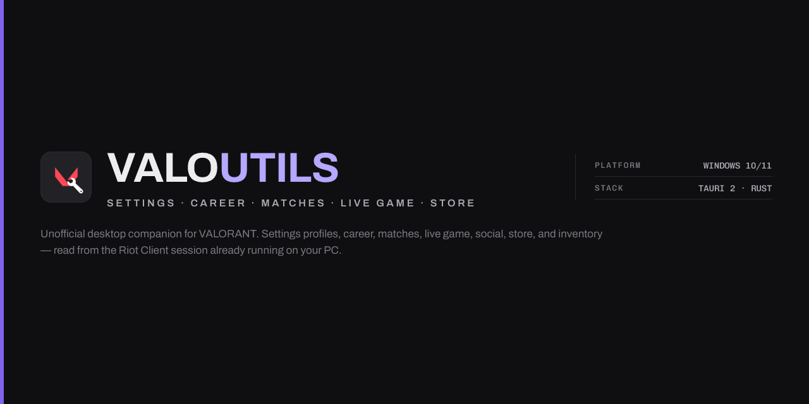

<p align="center">
  
</p>

<p align="center">
  <a href="https://github.com/windowsedd/ValoUtils/releases/latest"></a>
  <a href="https://github.com/windowsedd/ValoUtils/actions/workflows/build.yml"></a>
  
  
</p>

<p align="center">
  <strong>English</strong> · <a href="README.zh-TW.md">繁體中文</a>
</p>

ValoUtils is an unofficial Windows desktop companion for VALORANT. It manages complete settings profiles and brings account, match, live-game, social, store, Battle Pass, and inventory information into one app. ValoUtils uses the Riot Client session already running on your PC, so there is no separate ValoUtils account or sign-in.

## Features

### Profiles

- Save your current VALORANT settings as named profiles and restore them later.
- Rename, duplicate, delete, and inspect profiles without applying them.
- Review decoded general, control, crosshair, audio, and video settings, including crosshair previews and profile comparisons.
- Share a profile with a 10-character code that expires after 90 days, or import a code from another player.

### Career and matches

- View your current and peak competitive ranks, RR progress, and recent competitive updates.
- Browse match history with map and agent artwork, score summaries, and expandable scoreboards.
- Inspect player-level statistics including ACS, ADR, K/D/A, headshot percentage, and first bloods.
- Open player profiles from match results for rank summaries and recent performance.

### Live Game

- Follow your current party, pre-game lobby, or live match with automatic refreshes.
- See teams, party groups, selected agents, competitive ranks, previous-act ranks, and recent form.
- Keep the last useful snapshot visible through brief API outages and rate limits.

### Friends and Chat

- Browse your Riot friends with live presence, queue, map, score, party-size, and last-seen details.
- Open friend profiles to review rank and recent match information.
- Read and send direct messages, receive live presence updates, and translate messages in the app.
- Use the chat command system for supported party, team, and all-chat actions while VALORANT is running.

### Store, Battle Pass, and Inventory

- Check daily offers, the featured bundle, accessories, Night Market offers, and currency balances.
- Track current Battle Pass XP, level progress, and premium ownership.
- Browse owned weapon skins and accessories with search and category filters.

### Tools and quality of life

- Look up players by `GameName#Tag` or PUUID, review their rank and recent matches, and browse your own inventory.
- Use the built-in Riot API reference when developing or troubleshooting integrations.
- Run the interface in English, Korean, or Traditional Chinese.
- Receive minisign-verified updates on launch and during hourly checks when automatic updates are enabled.

## Requirements and privacy

- Windows 10 or Windows 11 on x64 hardware.
- **Riot Client must be running.** ValoUtils reads the local Riot Client lockfile to authenticate requests for the signed-in account.
- **VALORANT must be closed before restoring a profile.** The Riot Client applies the restored settings the next time the game starts.

ValoUtils does not ask for your Riot password and does not create a cloud account. Profiles and app configuration stay under `%APPDATA%\ValoUtils` on your PC. The app communicates with Riot's local client and private game services, fetches public game assets, and sends anonymous usage events to Aptabase. Profile data is uploaded to pastes.dev only when you explicitly create a share code. When you request a chat translation, the selected text is sent to your configured Google Translate or DeepL provider.

## Installation

Download the latest installer from [GitHub Releases](https://github.com/windowsedd/ValoUtils/releases/latest).

| File | Notes |
| --- | --- |
| `ValoUtils_x.x.x_x64-setup.exe` | Per-user NSIS installer; administrator access is not required. |

The installer is not currently Authenticode-signed, so Windows SmartScreen may show a warning on first launch. If you downloaded it from this repository's Releases page, select **More info → Run anyway**. Later updates are downloaded and verified by the app.

## Building from source

You will need [Bun](https://bun.sh), a stable Rust toolchain using the MSVC target, and the standard [Tauri prerequisites for Windows](https://v2.tauri.app/start/prerequisites/#windows).

```bash
git clone https://github.com/windowsedd/ValoUtils.git
cd ValoUtils

bun install
bun run dev
bun run build
```

Run the frontend and Rust checks before submitting changes:

```bash
bun test
bun run lint

cd src-tauri
cargo check
cargo clippy
cargo test --lib
```

`bun run dev` starts Vite and the Tauri development app with hot reload. `bun run build` produces the release NSIS installer.

### Updater signing key

`tauri.conf.json` embeds the updater public key, so `tauri build` refuses to bundle unless it can also find the matching private key:

```text
A public key has been found, but no private key. Make sure to set `TAURI_SIGNING_PRIVATE_KEY` environment variable.
```

The key must be exported into the shell that runs the build. A `.env` file is not enough — it only reaches the Vite frontend build, not the Tauri CLI child process. The key is an encrypted rsign secret key, so its password has to be set as well or the CLI stops to prompt for it.

```bash
export TAURI_SIGNING_PRIVATE_KEY="$(cat src-tauri/valoutils.key)"
export TAURI_SIGNING_PRIVATE_KEY_PASSWORD=""
bun run build
```

```powershell
$env:TAURI_SIGNING_PRIVATE_KEY = Get-Content src-tauri\valoutils.key -Raw
$env:TAURI_SIGNING_PRIVATE_KEY_PASSWORD = ""
bun run build
```

The build then writes the installer and its updater signature to `src-tauri/target/release/bundle/nsis/`.

`src-tauri/valoutils.key` is gitignored and is not part of a clone. To build your own signed installer, generate a keypair with `bun run tauri signer generate -w src-tauri/valoutils.key` and replace `plugins.updater.pubkey` in `src-tauri/tauri.conf.json` with the public key it prints. Never commit the private key or any `.env` file holding it.

## Architecture

```text
src-tauri/          Rust backend
  src/commands/     Tauri commands grouped by feature
  src/riot/         Riot Client lockfile, local API, and pd/glz API clients
  src/xmpp/         Riot chat connection and messaging
  src/store.rs      JSON-backed local application storage

src/                React frontend running in WebView2
  pages/            Product pages for profiles, matches, social, store, and tools
  components/       Shared viewers, scoreboards, navigation, and controls
  util/             Tauri IPC bridge, Riot helpers, assets, and shared utilities
```

Most frontend IPC goes through `src/util/tauri-bridge.ts`. The bridge maps channel names such as `settings:profile:load` to Rust commands such as `settings_profile_load`, then delivers command replies and backend events through the same listener interface. Profile-share imports use a small direct-`invoke()` helper in `src/util/share.ts`.

For authentication, the Rust backend reads the Riot Client lockfile and communicates with the local client over `127.0.0.1`. Account and game data then comes from Riot's private Player Data (`pd`) and Game (`glz`) services. Chat uses a dedicated XMPP connection. Settings profiles remain encoded during local storage so restoring a profile does not discard unknown settings.

## Releases

### Testing a production build

A release build is not a `bun run dev` session with a different flag: logging is compiled out, the frontend is the minified bundle, and the updater is live. Test it as its own thing before tagging.

Build the installer as described under [Updater signing key](#updater-signing-key). Two artifacts matter:

```text
src-tauri/target/release/valoutils.exe                              the app itself
src-tauri/target/release/bundle/nsis/ValoUtils_<version>_x64-setup.exe   what users run
```

Running the bare `.exe` is the fast check. Install through the NSIS installer when the change touches anything installer-shaped: shortcuts, the uninstall entry, or updating in place over an existing version.

Four things behave differently than in development:

- **There are no logs.** `tauri_plugin_log` is registered only under `debug_assertions`, so a production build prints nothing anywhere. To see the frontend console, set `openDevTools` to `true` in `%APPDATA%\ValoUtils\config.json` and relaunch — the `devtools` Cargo feature is compiled into release builds, so the inspector opens on startup.
- **State is shared with your normal install.** Profiles and settings live in `%APPDATA%\ValoUtils\*.json` regardless of how the app was built, so a test build reads and writes the same files your day-to-day install uses. Back that folder up before testing anything that writes to it.
- **The updater is running.** It checks on launch and hourly, gated by the `autoUpdate` config flag (default `true`). Set it to `false` while testing so a build you are inspecting does not replace itself with the published release.
- **A draft release is not `latest`.** The updater endpoint is `releases/latest/download/latest.json`, and GitHub does not count drafts as latest, so the workflow's draft release is safe to inspect. Publishing it is the step that ships the update to everyone.

Before tagging, confirm the version is consistent across `package.json`, `Cargo.toml` and `Cargo.lock` — the tag workflow fails on a mismatch:

```bash
bun run version:check 1.0.9
```

### Publishing

The GitHub Actions release workflow runs for `v*` tags. It verifies that the tag matches the project version, builds and signs the Tauri updater artifacts, and creates a draft GitHub Release containing the NSIS installer and update manifest. From a clean `master` branch, use the release helper to synchronize version metadata and create the release commit and annotated tag before pushing:

```bash
bun run version 1.0.8
git push origin HEAD:master --follow-tags
```

## Disclaimer

ValoUtils is an unofficial third-party tool. It is not affiliated with, endorsed by, or connected to Riot Games. It relies on private Riot APIs that may change, become restricted, or stop working at any time.

Restoring a profile overwrites your current VALORANT settings. Save your existing setup as a profile first if you may want to return to it.
